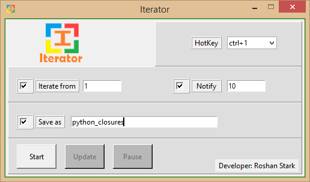
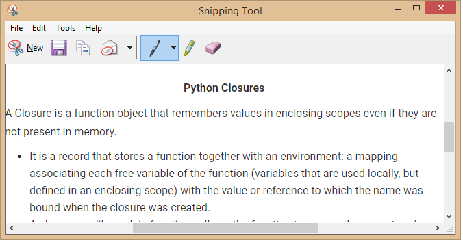

# Iterator
This software helps you to save the files automatically with specified names, if we press the press the specified hotkey.

example:
When learning python I used snip tool in windows OS to take screenshot of important points from the websites. So everytime I want to save that file I need to type the name. So I thought why not create a python software to do that tedious stuff for me. So here is the solution.

I am using the iterator software to save files as "python_closures"

 and I am using the snip tool to take screenshot

so everytime I take a screenshot, I just press hotkey (ctrl+1). Iteator saves the files like this

